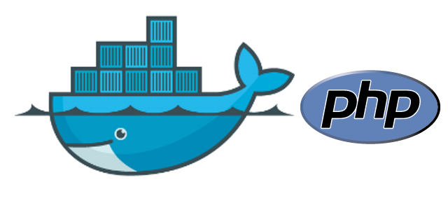

# Docker-PHP



## Features

- Customize the configuration file
- Data is stored in the host
- 
 
## Software Stack
- [x] MongoDB
- [x] Redis
- [x] MySQL
- [x] PHP 7.1 + PHP-FPM
- [x] Nginx with LuaJit

> If you use mongoDB, you need the mongoDB extension.Please read this post [PECl](http://www.myfreax.com/install-the-php-extension-with-pecl/)


## How to use it?

>If live behind the [GFW](https://zh.wikipedia.org/zh-hans/%E9%98%B2%E7%81%AB%E9%95%BF%E5%9F%8E) please read this post [Use Ali cloud](http://www.myfreax.com/use-aliyun-mirror-acceleration-on-docker/)


#### Requirements

- [Docker](https://www.docker.com/)

- [Docker-compose](https://github.com/docker/compose/releases)

>Windows and Mac users only need to install Docker

#### Getting started

```bash

git clone https://github.com/huangyanxiong01/docker-php.git

cd docker-php

docker-compose up -d
```
Now,you can open http://127.0.0.1:3000/ in browser


#### Configure 

You can find the custom $software configuration file in `./docker/$software/etc/`


#### Data

You can find the  $software data file in `./docker/$software/Data/`

## TODO
- [ ] Build a PHP image that contains all of the extensions
- [ ] Write a php test program
- [ ] Optimize the configuration file
- [ ] Write usage documentation
- [ ] Test on Windows


## Change Log
[ChangeLog.md](ChangeLog.md)


